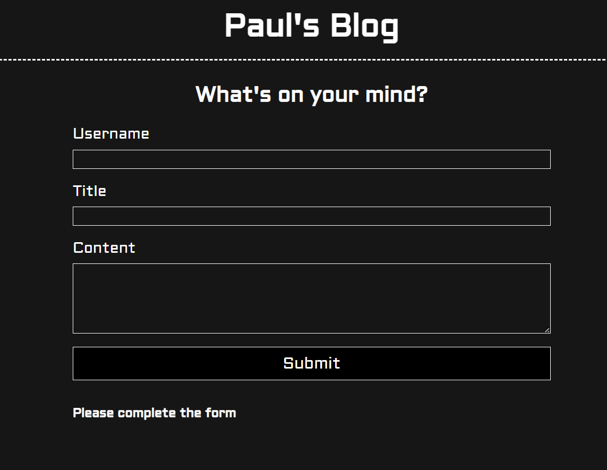
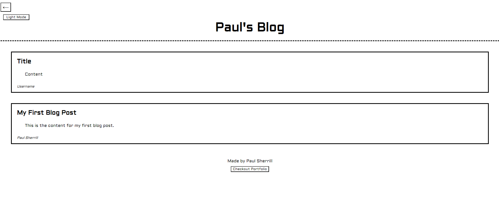

# Personal Blog

## Description

In this challenge, I was tasked with creating a two page website to submit and store blog posts. For the first page, I had to create a form where the user could submit a username, a title for their blog post, and the actual content in that post. When submitted, they were to be taken to the second page where their new post could be seen among any previous posts that were already created. If the form had any inputs left empty, a prompt was to pop up to tell them to fill in the form. On the next page, I was tasked with adding a light switch to make the page lighter or darker when pressed, a back button to bring them to the previous form page when clicked, and a link to my portfolio in the footer. 

## Installation

To install my code, I started with making the html file for the first page. I added a header as well as the input elements with labels to describe what to put in each one and unique IDs for each element. I then added a button called 'submit' to allow the user to submit the inputted information. 

After finishing the html, I then created the js file for it. On this file, I started by using querySelectors to grab each input element to manipulate. From there, I created a function to store the inputted information into the local storage for later use by creating a variable containing all the values of the input elements and using JSON to set the elements into the local storage. I then created a function that would render a message when inputs were empty. I then used an if statement within an event listener so that if any inputs were left empty the message would render else the function to store the inputted information would run as well as redirect the user to the next page. 

I then added all of my positioning and styling using a CSS sheet. There, I was able to position my labels above my inputs as well as make my page darker. I also added :hover styling to make the page look more responsive to the user.

After that, it was time to make the next page. I once again started with the html file with a header and then added a mock blog post to label where each element of the input would go. I also added button elements at various parts of the html to add all the buttons I needed (back, light switch, and portfolio link). 

Before moving onto the js file for this, I thought it would be easier to go ahead and position my page and style it using another CSS sheet. I added similar styling as the previous page to make it look together and complete. The main thing I focued on however was the positioning of my buttons and blog containers as well as the elemetns within those containers. 

Once finished with my styling, it was time to create the logic behind the page. The first step was to get my stored input onto the page by using JSON once again to get the local storage objects. I then had to display it onto the page. I did this by grabbing the container element in my html using a query selector and creating a new 'div' element and appending it into that container. I then had to append child elements into that 'div' and make their text content equal to the content in the local storage one by one. To make it look the same as the mock blog, I set their ID's to match that of each of the elements of that mock blog and the CSS sheet did the rest. My next plan of action was to create the light switch. I did this by creating a function called 'light' that set attributes to all of the elements on the page to the opposite of the dark styling they had before. I included a for loop in this function to make sure all elements created in the js file were included as well. To make this function usable I created an event listener on the button so that each time the button was pressed the function would run and add a number to a variable that equaled to zero. I used an if statement to state that if that variable was not zero and the button was pressed, th epage would refresh and go back to its default styling. This made it so that each time the button was pressed the styling of the page wouyld change to either light or dark. For the other buttons I simply used location redirectors within their event listeners to redirect the user to the pages they were suposed to take them to. 

## Usage

Once you arrive to my website you will see the form where you can submit a username, title, and content. 

If submitted when the from was not filled completely, you will be prompted to fill in the form.  

Otherwise, you will be redirected to a page where your blog is. 

On this page you will notice two buttons at the top. If the back button (button with arrow) is clicked, you will be taken back to the form page wqhere you can submit another blog post. If the button 'dark mode' is clicked the screen will become light and the button will be titled 'light mode'. If that is clicked again, the screen will return to dark mode. 

At the bottom of the page, you will see a footer containing a link to my portfolio. By clicking on that link, you will be redirected to my portfolio and will be able to view my other projects.